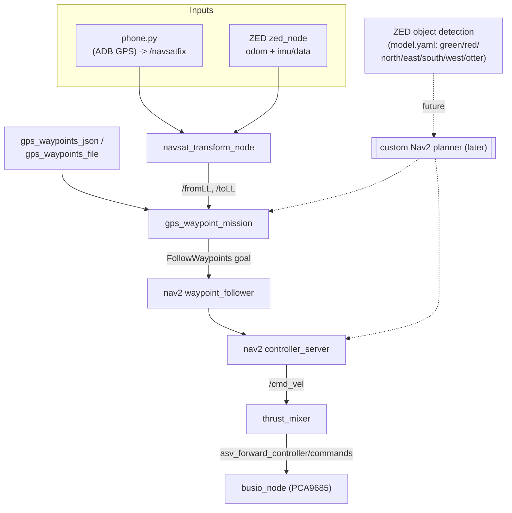

# Loon-E Roadmap: GPS Waypoint Navigation (Task 1 — Maneuvering & Path-Finding)

Tracks the path from "the boat can drive" to "the boat can run the Njord Task 1 course."
See `src/loone/README.md` for the general architecture; this file is scoped to the
GPS-waypoint / mission-planning line of work specifically.

## System diagram



Dashed = not built yet.

## Done

- [x] `thrust_mixer` + `ros2_control` + `busio_node` chain (`/cmd_vel` -> PCA9685).
- [x] Nav2 configured (`config/nav2_params.yaml`): planner/controller/costmaps + a
      `waypoint_follower` (stock `FollowWaypoints` action).
- [x] `navsat_transform_node` added alongside the ZED wrapper's own `gnss_fusion`
      (`config/navsat_transform.yaml`), purely to expose `/fromLL`/`/toLL` — does not
      touch the `map->odom->base_link` TF chain.

## Now — MVP GPS-waypoint mission (Task 1)

- [x] `src/loone/loone/gps_waypoint_mission.py`: reads a JSON list of `{"lat","lon"}`
      points, converts each via `/fromLL`, sends one `FollowWaypoints` goal. Covered by
      `test/test_gps_waypoint_mission.py` (JSON/file param parsing, pose/yaw building).
- [x] `src/loone/launch/task1.launch.py`: `bringup.launch.py` + `gps_waypoint_mission`.
- [x] `src/loone/config/task1_waypoints.json`: now holds a real 4-point course near Humber
      College (was a 3-point Toronto placeholder). **Fixed a bug 2026-07-26: the file had
      `//`-style trailing comments, which is invalid JSON — `_load_waypoints()` would have
      caught the `JSONDecodeError` and silently sent no mission.** Confirm these are the
      intended Task 1 points (vs. a bench/practice location) before running on the water.
- [ ] Bench-test: `ros2 launch loone task1.launch.py sim:=true use_sim_time:=true`,
      confirm `/fromLL` appears and the mission node converts points.
      **Blocked 2026-07-26**: `build/`, `install/`, `log/` are root-owned from an earlier
      `sudo colcon build`, and this session has no interactive TTY for a sudo password, so
      the new `gps_waypoint_mission` executable was never installed (`install/loone` still
      predates this feature — no `gps_waypoint_mission` console script, no `task1.launch.py`).
      Static checks (syntax, JSON, package/dependency resolution via `ros2 pkg list`) all
      passed. To finish this step, run once:
      `sudo colcon build --packages-select loone --symlink-install`, then
      `source install/setup.bash && ros2 launch loone task1.launch.py sim:=true use_sim_time:=true`
      (`sim:=true` swaps `busio_node` for `sim_state_echo`, so this does not drive real
      thrusters — but `slam_launch.py` still starts the real `zed_wrapper` node, which needs
      a camera or a mocked `/clock`/topics to fully validate).
- [ ] On-water test: verify `WAYPOINT_FRAME_ID = 'odom'` assumption in
      `gps_waypoint_mission.py` and the ZED `imu/data` topic name assumption in
      `bringup.launch.py`'s `navsat_transform` node (both marked `TODO(team)`). Needs a live
      ZED node to check `ros2 topic echo <camera_name>/<zed_node_name>/odom --field header.frame_id`
      — not checkable from this sandbox (no camera, and this session currently can't reach a
      live ROS graph beyond the local machine).

This MVP intentionally has **no awareness of buoys, cardinal marks, or the Otter** —
it will drive straight through the GPS points and rely only on Nav2's costmap/laser
obstacle avoidance. That's enough to prove out point-to-point GPS navigation, but not
enough to score well on Task 1's cardinal-mark/buoy-rule requirements below.

## Later — rule-aware planning

- [ ] New `ament_cmake` interfaces package `src/loone_msgs/` (custom interfaces can't
      live in the `ament_python` `loone` package — confirmed no such package exists yet):
  ```
  src/loone_msgs/
  ├── CMakeLists.txt        # rosidl_generate_interfaces(loone_msgs "msg/GNSSpoints.msg" "action/GNSSAction.action" DEPENDENCIES sensor_msgs)
  ├── package.xml           # ament_cmake, rosidl_default_generators, rosidl_interface_packages
  ├── msg/GNSSpoints.msg    # sensor_msgs/NavSatFix[] points
  └── action/GNSSAction.action
  ```
  - [ ] `GNSSAction.action` needs the second `---` (goal / result / **feedback**), even
        if feedback starts empty:
        ```
        sensor_msgs/NavSatFix[] points
        ---
        sensor_msgs/NavSatFix[] achieved
        ---
        ```
    Recommend populating feedback (e.g. `uint32 current_index`,
    `sensor_msgs/NavSatFix current_target`) — `nav2_msgs/action/FollowWaypoints` gives
    `current_waypoint` progress for free; don't regress that.
  - [ ] Keep `GNSSpoints.msg` as its own reusable message (not just inlined into the
        action) — publish "planned route" and "achieved route" on separate topics for
        the competition GUI requirement ("route taken... plotted against the ideal
        GNSS route").
- [ ] Custom Nav2 global-planner plugin that combines `GNSSAction` waypoints with ZED
      object detection to actually satisfy Task 1's rules:
  - Red buoy -> keep to port (boat's left) heading seaward; green -> keep to starboard.
  - Cardinal mark -> pass on the side it names (e.g. a North mark is passed to its north).
  - Otter -> detect and avoid (appearance is not fixed/reliable, so don't key off color).
  - `src/loone/config/model.yaml`'s existing 7-class ONNX model (`green`, `red`,
    `north`, `east`, `south`, `west`, `otter`) already matches this exactly — it's
    configured but unconsumed (`task_logic_Njord.py` had the only subscriber to
    `zed_msgs/ObjectsStamped` and is explicitly deprecated per `src/loone/README.md`).
  - AR tags are **not** relevant here — those are for the separate docking task.

## Task 1 rules (source: njord.gitbook.io, fetched 2026-07-26)

- Course: GPS point 1 -> GPS point 4 via **8–15 GPS waypoints** across two segments
  (1.1–1.10, 3.1–3.3). GUI must plot the ASV's actual route against the ideal GNSS route.
- **No red/green gate pairs** — these are port/starboard rules, not gates: red = keep
  on port side sailing seaward/north; green = keep on starboard side. 40cm buoys.
- **Cardinal marks** (N/E/S/W, black/yellow, 40cm): pass on the side named by the mark.
- **"Otter"**: a moving/variable-appearance obstacle — detect and avoid, don't rely on
  a fixed color/shape.
- **AR tags are for the docking task, not Task 1.**
- Scoring: Safety, Movement, Communication, Correct use of Cardinal Marks, GPS
  completion, Gate completion, Path completion; penalties for autonomy
  violations/collisions; bonus for an "elegant first-try run."
- Links:
  - [Course components overview](https://njord.gitbook.io/2026/10-course-components/10.1-course-components)
  - [Buoys](https://njord.gitbook.io/2026/10-course-components/10.2-buoys)
  - [Cardinal marks](https://njord.gitbook.io/2026/10-course-components/10.3-cardinal-marks)
  - [AR tags](https://njord.gitbook.io/2026/10-course-components/10.4-ar-tags) (docking task only)
  - [Otter](https://njord.gitbook.io/2026/10-course-components/10.5-otter)
  - [Task 1 description](https://njord.gitbook.io/2026/9-task-descriptions/9.1-maneuvering-and-path-finding)
  - [Task 1 evaluation rubric](https://njord.gitbook.io/2026/11-evaluation/11.7-task-1-maneuvering-path-finding)
